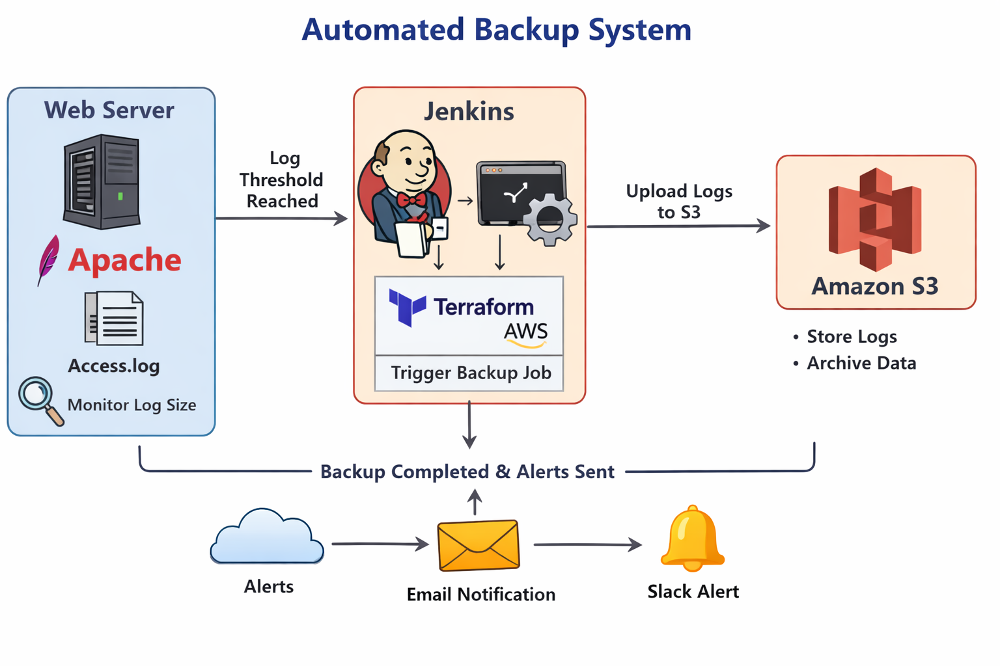

# Automated-Backup-and-Rotation-script-with-Google-Drive-Integration

### Automated Backup System with Google Drive Integration

This project implements a fully automated backup solution for project directories.
It creates timestamped backups, manages storage using rotation policies, and securely uploads backups to Google Drive using rclone.

The system ensures data safety, automation, and efficient storage management

### Architecture Overview

The Automated Backup System performs scheduled backups with rotation and cloud storage integration.

### Project Features

    • Automated project directory backup
    • Timestamp-based ZIP archive creation
    • Backup rotation (Daily / Weekly / Monthly)
    • Google Drive cloud backup using rclone
    • Logging system for backup history
    • Optional webhook notifications using curl

### Project Components
#### 1. Backup Engine

    The backup engine creates compressed .zip archives of the project directory.

    Backup files are stored in a structured format:

    ~/backups/ProjectName/YYYY/MM/DD/

    Example:

    ~/backups/MyProject/2026/03/06/MyProject_20260306_103000.zip

#### 2. Rotation & Retention Policy

    To prevent storage overflow, the script implements backup rotation.

    Retention rules:

    Daily Backups → Keep last 7 days
    Weekly Backups → Keep last 4 weeks
    Monthly Backups → Keep last 3 months

    Older backups are automatically deleted.

#### 3. Google Drive Integration

     Backups are uploaded to Google Drive using rclone CLI.

    Benefits:

    • Offsite backup storage
    • Secure cloud backup
    • Accessible from anywhere

#### Installation & Setup
#### Step 1 — Install Curl
     sudo yum install curl -y

     

#### Step 2 — Install rclone
    curl https://rclone.org/install.sh | sudo bash
    
    

#### Step 3 — Configure Google Drive
 
    Run:

       rclone config

    Follow the steps to create a remote named:

       gdrive

    Create a folder in Google Drive:

       BackupFolderName 

       

#### Step 4 — Make Script Executable
    chmod +x backup_script.sh

    

### Configuration

    The script configuration variables are defined at the top of the script.

    Example configuration:

    PROJECT_DIR=~/myproject
    PROJECT_NAME=MyProject
    BACKUP_PATH=~/backups/$PROJECT_NAME

    DAILY_KEEP=7
    WEEKLY_KEEP=4
    MONTHLY_KEEP=3

    GDRIVE_REMOTE=gdrive
    GDRIVE_FOLDER=BackupFolderName

### Usage

    Run the backup script manually:

        ./backup_script.sh

    You can also schedule it using cron.

    Example:

        0 2 * * * /home/user/backup_script.sh

    This runs the backup daily at 2 AM.

### Logging

    All backup operations are recorded in:

    backup.log

    Example log:

    2026-03-06 10:30:00 - Backup created: MyProject_20260306_103000.zip
    2026-03-06 10:30:05 - Uploaded to Google Drive: Success

    

#### Logs help track:

    • Backup creation
    • Upload status
    • Rotation cleanup

    

### How the System Works

    1️⃣ Creates timestamped ZIP backup of the project directory
    2️⃣ Stores backup in structured folder hierarchy
    3️⃣ Uploads backup to Google Drive using rclone
    4️⃣ Deletes old backups based on rotation rules
    5️⃣ Logs all operations for monitoring

### Conclusion

This project demonstrates a reliable automated backup solution using Linux scripting and cloud integration.

### Key benefits:

    • Automated data protection
    • Efficient storage management
    • Secure cloud backups
    • Easy monitoring through logs

    The system ensures data safety and minimal manual intervention.
### Author
    Sonali Ghuge

DevOps & Cloud Enthusiast

Email sonalighuge98@gmail.com

GitHub https://github.com/iamSonaliGhuge

LinkedIn https://www.linkedin.com/in/sonali-ghuge-b6635131b